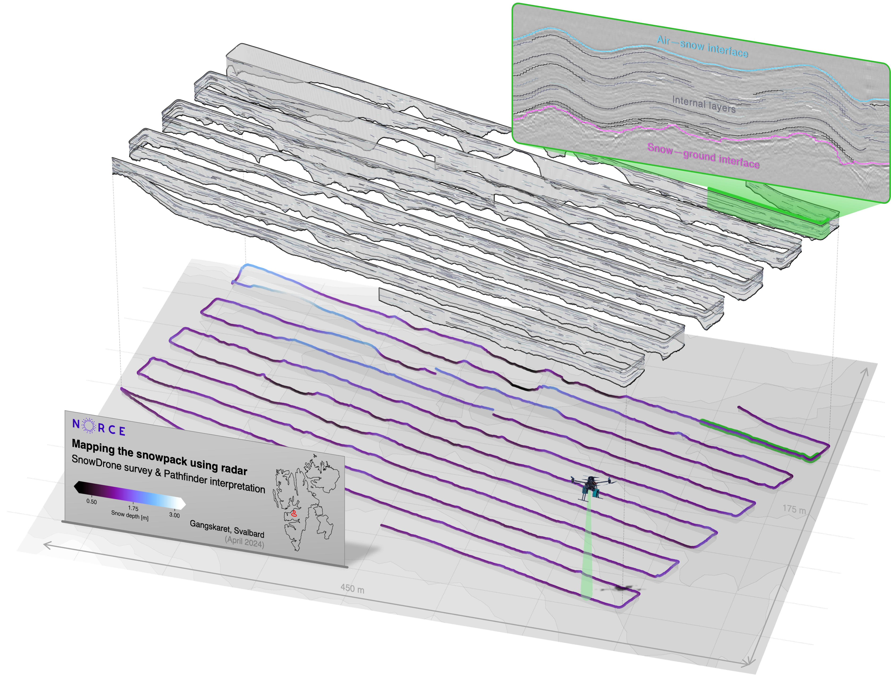

# Radar-Pathfinder
[](https://www.python.org/downloads/)

*Pathfinder* is a set of algorithms to automatically detect interfaces in surface-penetrating radar data (for snowy targets). It was developed for the UAV-mounted UWiBaSS system from NORCE Research AS in Tromsø ([Jenssen and Jacobsen (2020)](https://doi.org/10.1080/09205071.2020.1799871), [Jenssen et al (2024)](https://arc.lib.montana.edu/snow-science/objects/ISSW2024_P8.2.pdf)) for the purpose of automatically deriving snow depths (+ associated uncertainties) and stratigraphy. 



*Pathfinder* is presented in detail in the *Pathfinder_paper.pdf*-file (which is an internship report for my university) -- a more sophisticated publication is aimed for towards the end of 2025. To get started with using Pathfinder, have a look at the *running_Pathfinder.ipynb* notebook. All relevant information should be either there or in the pdf. If any questions arise: Let me know.

### Running it on your own GPR or radar data 
*Pathfinder* can be run on any 2D array and has been tested on various snow-measuring systems (also non-UAV-mounted)! Have a look at the *make_RADAR.ipynb* notebook to learn how to convert your data into something that *Pathfinder* can read.

### Requirements

*Pathfinder* is built with Python v3.13. Additional packages are listed in requirements.yml and can be installed using e.g. conda with:

```
(base) git clone https://github.com/Thorkage/Radar-Pathfinder
(base) cd ./Radar-Pathfinder
(base) conda env create -f requirements.yml
(base) conda activate pathfinder
```

and then you are ready to roll :)


### References

#### UWiBaSS:
Jenssen, Rolf Ole R., and Svein Jacobsen. “Drone-Mounted UWB Snow Radar: Technical Improvements and Field Results.” Journal of Electromagnetic Waves and Applications 34, no. 14 (2020): 1930–54. https://doi.org/10.1080/09205071.2020.1799871.


Jenssen, Rolf-Ole R, Hannah Vickers, Robert Ricker, Eirik Malnes, and Svein Jacobsen. Drone-Mounted Snow Radar System - Quantitative Field Validation of Terrestiran Snow Measurements. 2024. https://arc.lib.montana.edu/snow-science/objects/ISSW2024_P8.2.pdf

#### Other GPR/ radar systems that have been tested:

GEORESARCH UAV-mounted GPR:

Siebenbrunner, Anna. “UAV-Borne GPR for Snowpack Investigation.” Master Thesis, 2023.

Siebenbrunner, Anna, Robert Delleske, Rolf-Ole Rydeng Jenssen, and Markus Keuschnig. Unveiling Spatial Snow Depth Variability through UAV-Borne GPR in Alpine Environments. 2025.

Alfred-Wegener Institute helicopter-mounted GPR:

Pfaffling, Andreas. Ground Penetrating Radar Snow Thickness Profiling during WWOS 06, Field Data Report. 2007.

Pfaffhuber, Andreas A., Jan L. Lieser, and Christian Haas. “Snow Thickness Profiling on Antarctic Sea Ice with GPR—Rapid and Accurate Measurements with the Potential to Upscale Needles to a Haystack.” Geophysical Research Letters 44, no. 15 (2017): 7836–44. https://doi.org/10.1002/2017GL074202.


Kiwi snow radar from Gateway Antarctica:

Tan, Adrian Eng-Choon, Josh McCulloch, Wolfgang Rack, Ian Platt, and Ian Woodhead. “Radar Measurements of Snow Depth Over Sea Ice on an Unmanned Aerial Vehicle.” IEEE Transactions on Geoscience and Remote Sensing 59, no. 3 (2021): 1868–75. https://doi.org/10.1109/TGRS.2020.3006182.

Barras, Pauline, Adrian Eng-Choon Tan, Wolfgang Rack, et al. “Validation of a New Airborne Snow Radar on Antarctic Sea Ice.” Paper presented at IGARSS2025, Brisbane, Australia. 2025.
